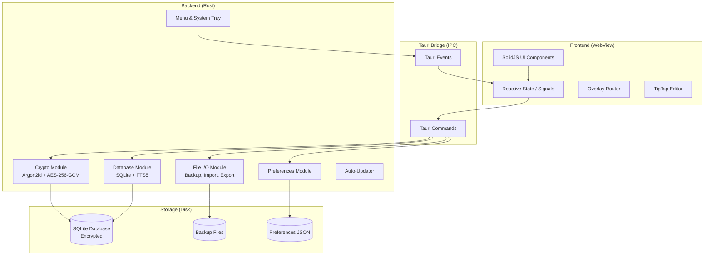
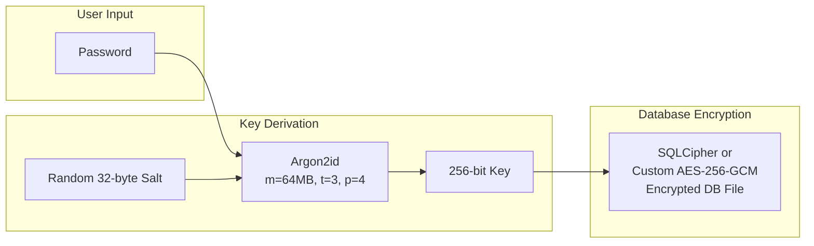
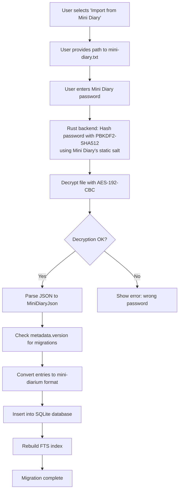
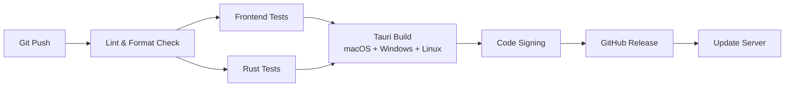

# mini-diarium — Implementation Plan

> A modern, open-source, privacy-focused desktop journaling application.
> Spiritual successor to Mini Diary. Not a fork — a ground-up reimplementation.

---

## Table of Contents

1. [Technology Stack](#1-technology-stack)
2. [Architecture](#2-architecture)
3. [Implementation Phases](#3-implementation-phases)
4. [Security Architecture](#4-security-architecture)
5. [Performance Strategy](#5-performance-strategy)
6. [Accessibility Plan](#6-accessibility-plan)
7. [Data Migration Strategy](#7-data-migration-strategy)
8. [Testing Strategy](#8-testing-strategy)
9. [Developer Experience](#9-developer-experience)
10. [Documentation Plan](#10-documentation-plan)
11. [Open Source Considerations](#11-open-source-considerations)
12. [Success Metrics & Quality Gates](#12-success-metrics--quality-gates)

---

## 1. Technology Stack

### 1.1 Core Framework

| Layer | Technology | Justification |
|-------|-----------|---------------|
| **Desktop Runtime** | [Tauri 2.x](https://tauri.app/) | Rust-based, ~10x smaller binaries than Electron, stronger security sandbox, native OS APIs, actively maintained |
| **Frontend Framework** | [SolidJS 1.x](https://www.solidjs.com/) | Fine-grained reactivity (no virtual DOM diffing), sub-millisecond updates, tiny bundle (~7 KB), TypeScript-first, familiar JSX syntax |
| **Build Tool** | [Vite 7.3.1](https://vitejs.dev/) | Latest stable release, fastest HMR in the ecosystem, native ESM, excellent Tauri integration via `@tauri-apps/cli` |
| **Package Manager** | [Bun](https://bun.sh/) (primary) or [pnpm](https://pnpm.io/) (fallback) | Bun: All-in-one toolkit, fastest package manager, built-in test runner; pnpm: Fast, disk-efficient, strict dependency resolution |
| **Language** | TypeScript 5.x (strict mode) | Type safety, IDE support, catches errors at compile time |

### 1.2 UI & Styling

| Concern | Technology | Justification |
|---------|-----------|---------------|
| **CSS** | [UnoCSS](https://unocss.dev/) | Atomic CSS with zero runtime, faster than Tailwind, full Tailwind preset compatibility |
| **Component Library** | [Kobalte](https://kobalte.dev/) | SolidJS-native unstyled accessible component primitives (dialog, popover, calendar, etc.) |
| **Icons** | [Lucide](https://lucide.dev/) | Fork of Feather Icons (used in original), actively maintained, tree-shakeable SVGs |
| **Theming** | CSS custom properties + OS detection | Light/Dark/Auto themes via `prefers-color-scheme` media query + CSS variables |

### 1.3 State Management & Data

| Concern | Technology | Justification |
|---------|-----------|---------------|
| **State Management** | SolidJS built-in signals + stores | No external library needed; SolidJS's reactive primitives are sufficient for this app's state complexity |
| **Local Database** | [SQLite via Tauri SQL plugin](https://v2.tauri.app/plugin/sql/) | Structured data, efficient querying, FTS5 for full-text search, single-file database, proven reliability |
| **Encryption** | Rust-side: `aes-gcm` (AES-256-GCM) + `argon2` | Modern, audited cryptographic primitives in Rust; AES-256-GCM provides authenticated encryption; Argon2id is the recommended password hashing algorithm |
| **Date/Time** | [Temporal API](https://tc39.es/proposal-temporal/docs/) polyfilled via `temporal-polyfill` | Modern, immutable date/time API; replaces moment.js; will become a browser built-in |

### 1.4 Editor

| Concern | Technology | Justification |
|---------|-----------|---------------|
| **Rich Text Editor** | [TipTap 2.x](https://tiptap.dev/) | Framework-agnostic (works with SolidJS), built on ProseMirror, Markdown support via extensions, actively maintained, extensible |
| **Markdown** | `@tiptap/extension-markdown` + `markdown-it` | Bidirectional Markdown ↔ ProseMirror conversion |

### 1.5 Search

| Concern | Technology | Justification |
|---------|-----------|---------------|
| **Full-Text Search** | SQLite FTS5 | Built into SQLite, no extra dependency, supports prefix matching, ranking, tokenization customization, handles large datasets efficiently |

### 1.6 Testing

| Concern | Technology | Justification |
|---------|-----------|---------------|
| **Unit Testing** | [Bun Test](https://bun.sh/docs/cli/test) (primary) or [Vitest](https://vitest.dev/) (fallback) | Bun Test: Built-in, extremely fast, Jest-compatible; Vitest: Native Vite integration, Jest-compatible API |
| **Component Testing** | [Solid Testing Library](https://github.com/solidjs/solid-testing-library) | Official SolidJS testing utilities |
| **E2E Testing** | [Playwright](https://playwright.dev/) | Cross-platform browser automation, supports Electron/Tauri via WebDriver |
| **Rust Testing** | Built-in `cargo test` | Standard Rust testing framework |

### 1.7 Build & Distribution

| Concern | Technology | Justification |
|---------|-----------|---------------|
| **Packaging** | Tauri bundler | Built-in support for DMG, MSI/NSIS, AppImage/DEB |
| **Auto-Update** | Tauri updater plugin | Built-in, secure update mechanism with signature verification |
| **CI/CD** | GitHub Actions | Free for open source, excellent ecosystem, Tauri official action available |

---

## 2. Architecture

### 2.1 High-Level Architecture



### 2.2 Rust Backend Module Design

```
src-tauri/
├── src/
│   ├── main.rs              # Tauri app entry point
│   ├── lib.rs               # Module declarations
│   ├── commands/             # Tauri command handlers
│   │   ├── mod.rs
│   │   ├── auth.rs           # Password, lock, unlock
│   │   ├── entries.rs        # CRUD operations
│   │   ├── search.rs         # Full-text search
│   │   ├── import.rs         # Import from various formats
│   │   ├── export.rs         # Export to various formats
│   │   ├── preferences.rs    # Settings management
│   │   └── stats.rs          # Statistics calculation
│   ├── crypto/               # Encryption/decryption
│   │   ├── mod.rs
│   │   ├── password.rs       # Argon2id hashing
│   │   └── cipher.rs         # AES-256-GCM encryption
│   ├── db/                   # Database operations
│   │   ├── mod.rs
│   │   ├── schema.rs         # Table definitions, migrations
│   │   └── queries.rs        # Prepared statements
│   ├── import/               # Import format parsers
│   │   ├── mod.rs
│   │   ├── dayone.rs
│   │   ├── jrnl.rs
│   │   ├── minidiary.rs
│   │   └── merge.rs
│   ├── export/               # Export format generators
│   │   ├── mod.rs
│   │   ├── json.rs
│   │   ├── markdown.rs
│   │   ├── pdf.rs
│   │   └── txt.rs
│   ├── backup/               # Backup management
│   │   └── mod.rs
│   └── i18n/                 # Internationalization
│       └── mod.rs
├── migrations/               # SQL migration files
├── Cargo.toml
└── tauri.conf.json
```

### 2.3 Frontend Architecture

```
src/
├── index.html
├── index.tsx                  # App entry point
├── App.tsx                    # Root component
├── components/
│   ├── layout/
│   │   ├── Sidebar.tsx
│   │   ├── EditorPanel.tsx
│   │   └── Header.tsx
│   ├── editor/
│   │   ├── DiaryEditor.tsx
│   │   ├── TitleEditor.tsx
│   │   ├── EditorToolbar.tsx
│   │   └── WordCount.tsx
│   ├── calendar/
│   │   ├── Calendar.tsx
│   │   ├── CalendarNav.tsx
│   │   └── DayCell.tsx
│   ├── search/
│   │   ├── SearchBar.tsx
│   │   └── SearchResults.tsx
│   ├── overlays/
│   │   ├── PreferencesOverlay.tsx
│   │   ├── ImportOverlay.tsx
│   │   ├── StatsOverlay.tsx
│   │   └── GoToDateOverlay.tsx
│   ├── auth/
│   │   ├── PasswordCreation.tsx
│   │   └── PasswordPrompt.tsx
│   └── ui/                    # Shared primitives
│       ├── Button.tsx
│       ├── Dialog.tsx
│       ├── Input.tsx
│       └── Banner.tsx
├── state/
│   ├── auth.ts                # Authentication state
│   ├── entries.ts             # Diary entries state
│   ├── preferences.ts         # Preferences state
│   ├── ui.ts                  # UI state (overlay, theme)
│   └── search.ts              # Search state
├── lib/
│   ├── tauri.ts               # Tauri IPC wrappers
│   ├── dates.ts               # Date utilities
│   ├── i18n.ts                # Translation utilities
│   └── theme.ts               # Theme management
├── styles/
│   ├── themes/
│   │   ├── light.css
│   │   └── dark.css
│   └── global.css
└── types/
    └── index.ts               # Shared TypeScript types
```

### 2.4 Database Schema

```sql
-- Core diary entries table
CREATE TABLE entries (
    date TEXT PRIMARY KEY,           -- 'YYYY-MM-DD' format
    title TEXT NOT NULL DEFAULT '',
    text TEXT NOT NULL DEFAULT '',    -- Markdown content
    date_updated TEXT NOT NULL,       -- ISO 8601 timestamp
    created_at TEXT NOT NULL DEFAULT (datetime('now'))
);

-- Full-text search index
CREATE VIRTUAL TABLE entries_fts USING fts5(
    title,
    text,
    content='entries',
    content_rowid='rowid',
    tokenize='unicode61 remove_diacritics 2'
);

-- Triggers to keep FTS index in sync
CREATE TRIGGER entries_ai AFTER INSERT ON entries BEGIN
    INSERT INTO entries_fts(rowid, title, text) VALUES (new.rowid, new.title, new.text);
END;

CREATE TRIGGER entries_ad AFTER DELETE ON entries BEGIN
    INSERT INTO entries_fts(entries_fts, rowid, title, text)
    VALUES('delete', old.rowid, old.title, old.text);
END;

CREATE TRIGGER entries_au AFTER UPDATE ON entries BEGIN
    INSERT INTO entries_fts(entries_fts, rowid, title, text)
    VALUES('delete', old.rowid, old.title, old.text);
    INSERT INTO entries_fts(rowid, title, text) VALUES (new.rowid, new.title, new.text);
END;

-- Application metadata
CREATE TABLE metadata (
    key TEXT PRIMARY KEY,
    value TEXT NOT NULL
);

-- Schema version tracking
CREATE TABLE schema_version (
    version INTEGER PRIMARY KEY
);
```

### 2.5 Encryption Architecture



**Key differences from Mini Diary's encryption**:
- **Argon2id** instead of PBKDF2 (memory-hard, resistant to GPU/ASIC attacks)
- **Random per-database salt** instead of hardcoded salt
- **AES-256-GCM** instead of AES-192-CBC (authenticated encryption with integrity checking)
- **Encryption handled in Rust** (not JavaScript) — keys never enter the WebView

---

## 3. Implementation Phases

### Phase 1: Foundation

**Goal**: Buildable Tauri app with Rust crypto backend, authentication flow, and basic diary entry CRUD.

#### Tasks

- [ ] **P1-01**: Initialize Tauri 2.x project with SolidJS frontend template
  - *AC*: `cargo tauri dev` launches a window with a SolidJS "Hello World" page
- [ ] **P1-02**: Set up development tooling
  - *AC*: ESLint, Prettier, UnoCSS, TypeScript strict mode all configured; `bun run lint` and `bun run format:check` pass
- [ ] **P1-03**: Implement Rust crypto module (Argon2id + AES-256-GCM)
  - *AC*: Unit tests pass for password hashing, key derivation, encrypt/decrypt round-trip; wrong password returns an error
- [ ] **P1-04**: Implement SQLite database module with encrypted storage
  - *AC*: Database can be created, opened with correct password, rejected with wrong password; schema is created on first open
- [ ] **P1-05**: Implement Tauri commands for authentication (create diary, unlock, lock, change password, reset)
  - *AC*: All auth commands callable from frontend; state transitions work correctly
- [ ] **P1-06**: Implement entry CRUD Tauri commands (create, read, update, delete)
  - *AC*: Entries can be created, read by date, updated, and deleted; empty entries are auto-deleted
- [ ] **P1-07**: Build Password Creation screen
  - *AC*: User can set a password; passwords must match; diary file is created on submit
- [ ] **P1-08**: Build Password Prompt screen
  - *AC*: User can unlock diary; wrong password shows error; correct password loads entries
- [ ] **P1-09**: Build basic two-panel layout (sidebar + editor area)
  - *AC*: Responsive layout renders with placeholder content; sidebar and editor areas are visible
- [ ] **P1-10**: Integrate TipTap editor with Markdown support
  - *AC*: User can type rich text; content is saved as Markdown; Markdown is loaded back into the editor correctly
- [ ] **P1-11**: Implement auto-save with 500 ms debounce
  - *AC*: Entry saves automatically after typing stops; saves on blur; saves on window close
- [ ] **P1-12**: Build basic calendar widget with date selection
  - *AC*: Monthly calendar renders; clicking a day selects it and loads its entry; days with entries are highlighted

**Deliverable**: A functional journaling app where users can create a password-protected diary, write daily entries with rich text, navigate dates via a calendar, and have entries auto-saved.

---

### Phase 2: Core Features

**Goal**: Full feature parity with Mini Diary's core user-facing features.

#### Tasks

- [ ] **P2-01**: Implement full-text search using SQLite FTS5
  - *AC*: Search returns results matching title or text; prefix matching works; results are sorted by date (newest first)
- [ ] **P2-02**: Build search bar and search results UI
  - *AC*: Debounced search input (immediate dispatch on clear); results list in sidebar with date and title (or "No title" fallback); "No results" banner when empty; clicking a result navigates to that date; clear button resets; Go To Today button next to search bar
- [ ] **P2-03**: Implement editor toolbar (Bold, Italic, Ordered List, Unordered List)
  - *AC*: Toolbar buttons toggle formatting; active styles are visually indicated; keyboard shortcuts (Ctrl/Cmd+B, Ctrl/Cmd+I) work
- [ ] **P2-04**: Implement word count display
  - *AC*: Word count displays for the current entry; updates after each auto-save (reflecting persisted content)
- [ ] **P2-05**: Implement title editor (separate from body)
  - *AC*: Title is plain text; Enter in title moves focus to body editor; title is saved alongside body
- [ ] **P2-06**: Build calendar navigation (next/previous month, month/year header)
  - *AC*: Arrow buttons navigate months; header shows current month and year
- [ ] **P2-07**: Implement date navigation keyboard shortcuts and menu items
  - *AC*: Next day, previous day, go to today, next month, previous month all work via menu and shortcuts
- [ ] **P2-08**: Implement "Go To Date" overlay
  - *AC*: Overlay with date input opens; submit button disabled when date is unchanged, undefined, or in future (if restricted); selecting a date and submitting navigates to it and closes overlay
- [ ] **P2-09**: Implement future date restriction with preference toggle
  - *AC*: Future dates disabled by default; enabling preference allows future date selection
- [ ] **P2-10**: Implement first day of week preference
  - *AC*: Calendar renders with configured first day; system locale default works when set to null
- [ ] **P2-11**: Implement hide titles preference
  - *AC*: When enabled, title editor is hidden; entries still retain title data
- [ ] **P2-12**: Implement spellcheck preference
  - *AC*: Toggling spellcheck enables/disables browser spellcheck in editors
- [ ] **P2-13**: Build statistics overlay
  - *AC*: Shows total entries, entries/week, best streak, current streak, total words, words/entry; numbers formatted with locale separators

**Deliverable**: A feature-complete journaling app with search, formatting toolbar, word count, statistics, and all calendar navigation features.

---

### Phase 3: Import, Export, & Theming

**Goal**: Full import/export capability, theming, and preferences system.

#### Tasks

- [ ] **P3-01**: Implement Mini Diary JSON import (with entry merging)
  - *AC*: Existing Mini Diary JSON files import correctly; conflicting dates merge titles with " | " and texts with separator
- [ ] **P3-02**: Implement Day One JSON import
  - *AC*: Day One JSON files import correctly; titles extracted from text; timezone handling works
- [ ] **P3-03**: Implement jrnl JSON import
  - *AC*: jrnl JSON files import correctly; date, title, body fields mapped properly
- [ ] **P3-04**: Implement Day One TXT import
  - *AC*: Day One TXT files import correctly; date parsing handles "DD MMMM YYYY" format
- [ ] **P3-05**: Build import overlay UI with format selection and file picker
  - *AC*: User can select format, see instructions, pick a file, and start import; errors shown in dialog
- [ ] **P3-06**: Implement Mini Diary JSON export
  - *AC*: Exports sorted entries with metadata; JSON is pretty-printed with tabs
- [ ] **P3-07**: Implement Markdown export
  - *AC*: Exports all entries as a formatted Markdown document with date headings
- [ ] **P3-08**: Implement PDF export
  - *AC*: Exports a styled PDF document (A4 page size)
- [ ] **P3-09**: Implement theme system (Light, Dark, Auto)
  - *AC*: Theme preference persists; auto mode follows OS; theme changes apply immediately without restart
- [ ] **P3-10**: Build preferences overlay with all settings
  - *AC*: All preferences accessible; sections conditionally shown based on lock state (theme and file directory always visible; first day of week, entries, password only when unlocked); directory change hidden in sandboxed builds; immediate persistence on change
- [ ] **P3-11**: Implement diary file directory selection and move
  - *AC*: When unlocked, file is moved to new directory; error shown if destination already has a diary file; when locked, directory preference is simply updated to point to a new location; check for existing file after change
- [ ] **P3-12**: Implement backup system (50 rolling backups on unlock)
  - *AC*: Backup created on successful unlock; older backups pruned to 50

**Deliverable**: Full import/export support (4 import formats, 3 export formats), complete theming, and comprehensive preferences.

---

### Phase 4: Internationalization, Polish, & Distribution

**Goal**: Multi-language support, accessibility improvements, platform-specific polish, and release packaging.

#### Tasks

- [ ] **P4-01**: Implement i18n framework with English and Spanish
  - *AC*: All UI text uses translation keys; English (default) and Spanish languages implemented; language auto-detected from OS; fallback to English for unsupported locales; architecture supports adding more languages in the future
- [ ] **P4-02**: Implement application menu (platform-specific)
  - *AC*: macOS app menu follows platform conventions; Windows/Linux menu has Preferences in File; all menu items are translated; items disabled when diary locked
- [ ] **P4-03**: Implement screen-lock auto-lock
  - *AC*: Diary locks when OS screen locks on macOS and Windows
- [ ] **P4-04**: Implement auto-update system
  - *AC*: App checks for updates on launch; downloads and installs updates (with user notification)
- [ ] **P4-05**: Accessibility audit and improvements
  - *AC*: All interactive elements have ARIA labels; focus management for overlays; keyboard navigation for calendar; screen reader tested on at least one platform
- [ ] **P4-06**: Implement data migration from Mini Diary format
  - *AC*: Users can import their existing `mini-diary.txt` encrypted file (see Section 7)
- [ ] **P4-07**: Set up CI/CD pipeline with GitHub Actions
  - *AC*: Automated builds for macOS, Windows, Linux on every push; tests run; artifacts produced
- [ ] **P4-08**: Configure Tauri bundler for all platforms (DMG, MSI/NSIS, AppImage/DEB)
  - *AC*: Installable packages produced for all three platforms
- [ ] **P4-09**: Write end-user documentation (README, user guide)
  - *AC*: README with screenshots, feature list, installation instructions; basic user guide
- [ ] **P4-10**: Prepare open-source release (LICENSE, CONTRIBUTING, CODE_OF_CONDUCT)
  - *AC*: All standard open-source files in place; contribution guidelines documented
- [ ] **P4-11**: Final QA pass across all platforms
  - *AC*: All features tested on macOS, Windows, and Linux; no critical bugs

**Deliverable**: Production-ready v1.0 release with bilingual support (English/Spanish), accessibility, auto-updates, and platform installers.

---

## 4. Security Architecture

### 4.1 Encryption Design

| Property | Mini Diary (current) | mini-diarium (planned) |
|----------|---------------------|----------------------|
| Password hashing | PBKDF2-SHA512, 500K iterations | Argon2id (m=64MB, t=3, p=4) |
| Salt | Hardcoded static salt | Random 32-byte salt per database |
| Encryption | AES-192-CBC (no IV) | AES-256-GCM (authenticated) |
| Crypto runtime | Node.js (JavaScript) | Rust (`aes-gcm`, `argon2` crates) |
| Key exposure | Password hash in JS heap (Redux) | Password hash in Rust memory only; never sent to WebView |
| API | Deprecated `createCipher` | Modern `aes-gcm` AEAD |

### 4.2 Security Principles

1. **Cryptographic material never enters the WebView**: All encryption/decryption happens in the Rust backend. The frontend only sends the plaintext password over the Tauri IPC bridge (which is local, not network-exposed).
2. **Authenticated encryption**: AES-256-GCM provides both confidentiality and integrity checking. Tampered ciphertext is detected and rejected.
3. **Memory-hard password hashing**: Argon2id is resistant to GPU and ASIC attacks, unlike PBKDF2.
4. **Per-database random salt**: Prevents rainbow table attacks across users.
5. **Secure memory**: Use Rust's `zeroize` crate to zero out sensitive data (password, key) when no longer needed.
6. **CSP headers**: Tauri's default Content Security Policy prevents XSS. Additional hardening:
   ```json
   "security": {
     "csp": "default-src 'self'; script-src 'self'; style-src 'self' 'unsafe-inline'"
   }
   ```
7. **No remote code execution**: No `eval()`, no remote script loading, no `dangerouslySetInnerHTML` (SolidJS doesn't have this pattern).
8. **Update signature verification**: Tauri updater verifies update signatures to prevent supply chain attacks.

### 4.3 Threat Model

| Threat | Mitigation |
|--------|-----------|
| Disk theft / forensics | Database encrypted at rest with AES-256-GCM |
| Shoulder surfing | Auto-lock on screen lock; manual lock via menu |
| Password brute force | Argon2id with high memory cost (64 MB per hash) |
| Memory dump of running app | Keys zeroed after use; keys stay in Rust memory (not JS heap) |
| Malicious update | Tauri update signature verification |
| XSS / code injection | Tauri CSP; no `eval`; SolidJS template compilation |
| File tampering | GCM authentication tag detects modifications |

---

## 5. Performance Strategy

### 5.1 Key Optimizations

| Area | Strategy |
|------|----------|
| **Startup** | Lazy-load the editor; render auth screen immediately; decrypt database in background |
| **Entry save** | Debounced writes (500 ms); SQLite single-row UPDATE (not full file rewrite) |
| **Search** | SQLite FTS5 handles indexing natively; queries in < 100 ms for 10K+ entries |
| **Rendering** | SolidJS fine-grained reactivity: only re-renders the specific DOM nodes that change |
| **Large diaries** | SQLite can handle millions of rows; entries loaded on demand (not all at once) |
| **Editor** | TipTap/ProseMirror is optimized for performance; no full re-render on keystrokes |
| **Export** | Run in Rust backend thread; UI shows progress indicator; no renderer blocking |
| **Bundle size** | Tauri produces ~5-15 MB installers (vs. ~150 MB for Electron) |
| **Memory** | No full diary loaded into memory; only current entry + search index metadata |

### 5.2 Benchmarks to Validate

| Metric | Target |
|--------|--------|
| Cold startup to unlock screen | < 500 ms |
| Unlock (decrypt + load) with 1,000 entries | < 1 second |
| Entry save (debounced write) | < 50 ms |
| Search query (10,000 entries) | < 100 ms |
| Export JSON (10,000 entries) | < 2 seconds |
| Export PDF (10,000 entries) | < 10 seconds |
| Memory usage (idle, diary open) | < 100 MB |
| Installer size | < 20 MB |

---

## 6. Accessibility Plan

### 6.1 WCAG 2.1 AA Compliance Targets

| Criterion | Implementation |
|-----------|---------------|
| **1.1.1 Non-text Content** | All icons have `aria-label`; decorative icons have `aria-hidden="true"` |
| **1.3.1 Info and Relationships** | Semantic HTML throughout; headings, lists, tables, form labels |
| **1.4.3 Contrast** | Minimum 4.5:1 contrast ratio for text; 3:1 for large text |
| **1.4.11 Non-text Contrast** | UI component boundaries and icons have 3:1 contrast |
| **2.1.1 Keyboard** | All functionality accessible via keyboard; visible focus indicators |
| **2.1.2 No Keyboard Trap** | Focus can always be moved away from any component |
| **2.4.3 Focus Order** | Logical tab order; focus trapped within open overlays |
| **2.4.7 Focus Visible** | Visible focus outline on all interactive elements |
| **3.3.1 Error Identification** | Error messages associated with form fields via `aria-describedby` |
| **4.1.2 Name, Role, Value** | All custom components have appropriate ARIA roles |

### 6.2 Specific Implementations

- **Calendar**: Full keyboard navigation (arrow keys for days, page up/down for months); `role="grid"` with `role="gridcell"` for days.
- **Overlays**: Focus trapped inside when open; `role="dialog"` with `aria-modal="true"`; focus returned to trigger element on close.
- **Editor**: ARIA labels for toolbar buttons; live region announcements for auto-save status.
- **Search**: `role="search"` landmark; `aria-live="polite"` for result count announcements.
- **Theme**: Respects `prefers-reduced-motion`; no animations that could trigger vestibular disorders.

---

## 7. Data Migration Strategy

### 7.1 Migrating from Mini Diary

Since mini-diarium uses a different encryption scheme, direct file reading is not possible. The migration requires the user's password.

#### Migration Flow



#### Implementation Details

1. **Rust module**: `src-tauri/src/import/minidiary_legacy.rs`
   - Implements the exact PBKDF2-SHA512 hashing with the original static salt.
   - Implements AES-192-CBC decryption using the deprecated (but available in Rust) cipher.
   - Applies the v2.0.0 Markdown migration if needed.
2. **Merge strategy**: Same as Mini Diary — conflicting dates merge titles and texts with separators.
3. **One-time process**: Migration is a one-directional import. The original file is not modified.

### 7.2 Migration from Other Formats

All four import formats from Mini Diary are supported (see FR-IMPORT-2 through FR-IMPORT-6 in REQUIREMENTS.md). The Rust backend implements the same parsing logic.

---

## 8. Testing Strategy

### 8.1 Test Pyramid

```
         /\
        /  \     E2E Tests (Playwright)
       / 10 \    Cross-platform workflows
      /------\
     /        \  Integration Tests
    /   20%    \ Tauri command + DB tests
   /------------\
  /              \ Unit Tests
 /      70%       \ Rust modules + JS utilities
/------------------\
```

### 8.2 Test Categories

| Category | Scope | Tool | Examples |
|----------|-------|------|---------|
| **Rust unit tests** | Crypto, parsers, utilities | `cargo test` | Password hashing, encryption round-trip, import parsing, entry merging, statistics calculation |
| **Frontend unit tests** | Components, state, utilities | Bun Test (or Vitest) + Solid Testing Library | Date formatting, theme resolution, component rendering, state transitions |
| **Integration tests** | Tauri commands + SQLite | Bun Test (or Vitest) + Tauri test utils | Create diary, CRUD entries, search, import/export, preference persistence |
| **E2E tests** | Full user workflows | Playwright | First-time setup, daily journaling, search, import, export, password change, theme switch |

### 8.3 Test Data

- **Fixtures**: Sample files for all import formats (Day One JSON, jrnl JSON, Mini Diary JSON, Day One TXT) — reuse Mini Diary's test fixtures.
- **Seed data**: Generator script to create N entries for performance testing.

### 8.4 Coverage Targets

| Module | Target |
|--------|--------|
| Rust crypto | 100% |
| Rust import/export parsers | 95% |
| Rust database operations | 90% |
| Frontend state management | 90% |
| Frontend components | 80% |
| E2E critical paths | 100% of user workflows |

---

## 9. Developer Experience

### 9.1 Project Setup

```bash
# Prerequisites
# - Bun 1.1+ (or Node.js 20+ with pnpm 9+), Rust 1.75+, system dependencies per Tauri docs

git clone https://github.com/<org>/mini-diarium.git
cd mini-diarium

# Using Bun (recommended)
bun install
bun tauri dev   # Launches dev mode with HMR

# Or using pnpm
pnpm install
pnpm tauri dev
```

### 9.2 Code Quality Tools

| Tool | Purpose | Configuration |
|------|---------|---------------|
| TypeScript 5.x (strict) | Type checking | `tsconfig.json` with `strict: true` |
| ESLint + `eslint-plugin-solid` | JS/TS linting | `.eslintrc.cjs` |
| Prettier | Code formatting | `.prettierrc` |
| `clippy` | Rust linting | `cargo clippy -- -D warnings` |
| `rustfmt` | Rust formatting | `rustfmt.toml` |
| Husky + lint-staged | Pre-commit hooks | Lint and format staged files |
| Commitlint | Commit message format | Conventional commits |

### 9.3 CI/CD Pipeline



### 9.4 Monorepo Structure

```
mini-diarium/
├── src/                    # SolidJS frontend
├── src-tauri/              # Rust backend
├── tests/
│   ├── unit/               # Unit test files
│   ├── integration/        # Integration test files
│   ├── e2e/                # Playwright E2E tests
│   └── fixtures/           # Test data files
├── docs/                   # Documentation
├── .github/
│   ├── workflows/          # CI/CD
│   ├── ISSUE_TEMPLATE/
│   └── PULL_REQUEST_TEMPLATE.md
├── package.json
├── Cargo.toml (workspace)
├── vite.config.ts
├── vitest.config.ts
├── playwright.config.ts
├── tsconfig.json
├── LICENSE
├── CONTRIBUTING.md
├── CODE_OF_CONDUCT.md
└── README.md
```

---

## 10. Documentation Plan

### 10.1 User Documentation

| Document | Content |
|----------|---------|
| **README.md** | Project description, screenshots, feature list, download links, quick start |
| **User Guide** | How to use each feature; accessible from Help menu and website |
| **FAQ** | Common questions: data location, backup recovery, migration from Mini Diary |
| **Privacy Policy** | What data is collected (none), where data is stored (local only) |

### 10.2 Developer Documentation

| Document | Content |
|----------|---------|
| **CONTRIBUTING.md** | How to set up development environment, run tests, submit PRs |
| **ARCHITECTURE.md** | High-level design, module responsibilities, data flow |
| **API.md** | Tauri command reference with input/output types |
| **SECURITY.md** | Encryption design, threat model, responsible disclosure policy |

---

## 11. Open Source Considerations

### 11.1 License

**MIT License** — permissive, matches Mini Diary's original license, maximizes adoption.

### 11.2 Repository Setup

- [ ] GitHub repository with branch protection on `main`
- [ ] Issue templates: Bug Report, Feature Request, Migration Help
- [ ] Pull request template with checklist
- [ ] GitHub Discussions enabled for community Q&A
- [ ] Dependabot / Renovate for dependency updates
- [ ] Security advisories enabled

### 11.3 Community Guidelines

- [ ] `CODE_OF_CONDUCT.md` — Contributor Covenant v2.1
- [ ] `CONTRIBUTING.md` — Development setup, coding standards, PR process
- [ ] `SECURITY.md` — Vulnerability reporting process
- [ ] `CHANGELOG.md` — Keep a Changelog format, auto-generated from conventional commits

### 11.4 Release Process

1. Feature branch → PR → review → merge to `main`
2. Version bump via `bun version` (or `pnpm version`) + `cargo set-version`
3. Git tag triggers CI build for all platforms
4. GitHub Release created with binaries and changelog
5. Update server notified for auto-update distribution

---

## 12. Success Metrics & Quality Gates

### 12.1 Phase Completion Criteria

| Phase | Gate |
|-------|------|
| **Phase 1** | User can create diary, write entries, navigate calendar, entries persist across sessions |
| **Phase 2** | Feature parity with Mini Diary's daily-use features (search, stats, formatting, preferences) |
| **Phase 3** | All 4 import formats + 3 export formats work; theming works; backup system works |
| **Phase 4** | English and Spanish i18n; accessibility audit pass; CI/CD producing signed installers; migration from Mini Diary tested |

### 12.2 Release Quality Gates (v1.0)

| Criterion | Requirement |
|-----------|-------------|
| **Test coverage** | ≥ 85% overall; 100% for crypto module |
| **Zero critical/high bugs** | No open P0/P1 issues |
| **Performance** | Meets all benchmarks in Section 5.2 |
| **Accessibility** | WCAG 2.1 AA compliance for all critical workflows |
| **Security** | No known vulnerabilities in dependencies; encryption independently reviewed |
| **Platform testing** | Manual QA on macOS (ARM + Intel), Windows 10/11, Ubuntu 22.04+ |
| **Documentation** | README, user guide, CONTRIBUTING, SECURITY all complete |
| **Bundle size** | Installer < 20 MB on all platforms |

### 12.3 Ongoing Quality Metrics

| Metric | Target |
|--------|--------|
| Dependency freshness | All dependencies within 1 major version of latest |
| CI build time | < 15 minutes for full matrix |
| Issue response time | Triage within 48 hours |
| Release cadence | At least quarterly patch releases |
