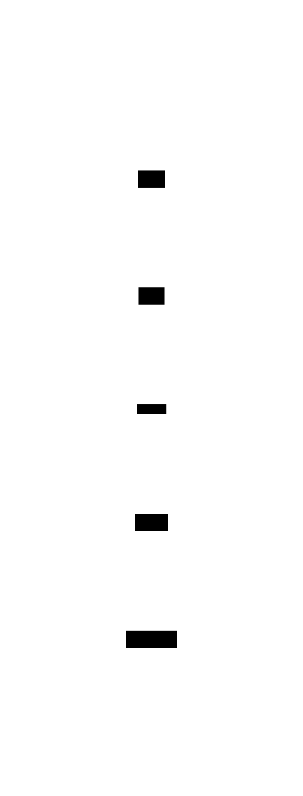

# Mini Diarium

[](https://github.com/fjrevoredo/mini-diarium/actions/workflows/ci.yml)
[](https://opensource.org/licenses/MIT)
[](https://github.com/fjrevoredo/mini-diarium/releases)
[](https://github.com/fjrevoredo/mini-diarium#installation)

An encrypted, local-first desktop journaling app.

Mini Diarium keeps your journal private. Every entry is encrypted with AES-256-GCM before it touches disk, the app never connects to the internet, and your data never leaves your machine. Built with Tauri, SolidJS, and Rust.

## Background

Mini Diarium is a spiritual successor to [Mini Diary](https://github.com/samuelmeuli/mini-diary) by Samuel Meuli. I loved the original tool. It was simple, private, and did exactly what a journal app should do. Unfortunately, it's been unmaintained for years and its dependencies have aged out. I initially thought about forking it and modernizing the stack, but turned out impractical. So I started over from scratch, keeping the same core philosophy (encrypted, local-only, minimal) while rebuilding completely with Tauri 2, SolidJS, and Rust. The result is a lighter, faster app with stronger encryption and a few personal touches.

## Features

- **Encryption at rest**: AES-256-GCM with Argon2id key derivation
- **Rich text editor** 
- **Full-text search**
- **Calendar navigation**
- **Import**: Mini Diary JSON and Day One JSON with merge conflict resolution
- **Export**: JSON and Markdown formats
- **Themes**
- **Automatic backups**: periodic database backups with rotation
- **Statistics**
- **Preferences**: first day of week, future entries toggle, title visibility, spellcheck, password change
- **Cross-platform**: Windows, macOS, and Linux
- **Zero network access**: no telemetry, no analytics, no update checks

## Architecture

Mini Diarium uses a layered architecture with clear separation of concerns:



The application is structured into 6 layers:

1. **Presentation Layer**
2. **State Layer**
3. **IPC Layer**
4. **Backend Commands**
5. **Business Logic**
6. **Data Store**

**Key Pattern**: All entry writes perform a **dual write**—updating both the encrypted `entries` table and the plaintext `entries_fts` search index. This ensures search stays synchronized.

For a detailed architecture diagram showing all components and data flows, see [docs/architecture-full.svg](docs/architecture-full.svg).

## Installation

Download the latest release for your platform:

| Platform | Format                                               |
| -------- | ---------------------------------------------------- |
| Windows  | `.msi` or `.exe` (NSIS installer, no admin required) |
| macOS    | `.dmg`                                               |
| Linux    | `.AppImage` or `.deb`                                |

### Installation Notes

**Windows**

On first launch, Windows SmartScreen may show a warning ("Windows protected your PC"). This is expected for unsigned applications. Click "More info" then "Run anyway" to proceed. Mini Diarium is open source and builds are reproducible from source.

**macOS**

macOS Gatekeeper may block the app on first launch. Right-click the app icon and select "Open" to bypass the warning. Once opened, subsequent launches work normally.

**Linux**

No code signing is required. For security, verify the SHA256 checksum against `checksums-linux.txt` from the release before installation:

```bash
sha256sum Mini-Diarium-*.AppImage
# Compare with checksums-linux.txt
```

## Quick Start

1. Launch Mini Diarium
2. Create a password (this encrypts your diary; there is no recovery if forgotten)
3. Write your first entry. It auto-saves as you type
4. Navigate between days with `Ctrl+Left` / `Ctrl+Right` or click dates on the calendar
5. Lock your diary when you're done

## Keyboard Shortcuts

| Action         | Shortcut           |
| -------------- | ------------------ |
| Previous Day   | `Ctrl+Left`        |
| Next Day       | `Ctrl+Right`       |
| Go to Today    | `Ctrl+T`           |
| Go to Date     | `Ctrl+G`           |
| Previous Month | `Ctrl+Shift+Left`  |
| Next Month     | `Ctrl+Shift+Right` |
| Preferences    | `Ctrl+,`           |
| Statistics     | `Ctrl+I`           |
| Import         | `Ctrl+Shift+I`     |
| Export         | `Ctrl+Shift+E`     |

On macOS, use `Cmd` instead of `Ctrl`.

## Building from Source

**Prerequisites:** Rust 1.75+, Bun 1.x, and [Tauri v2 system dependencies](https://v2.tauri.app/start/prerequisites/).

```bash
git clone https://github.com/fjrevoredo/mini-diarium.git
cd mini-diarium
bun install
bun run tauri build
```

Artifacts will be in `src-tauri/target/release/bundle/`.

## Tech Stack

- [Tauri 2](https://v2.tauri.app/): desktop app framework (Rust backend, web frontend)
- [SolidJS](https://www.solidjs.com/): reactive UI framework
- [Rust](https://www.rust-lang.org/): backend logic, encryption, database
- [SQLite](https://www.sqlite.org/): local database with FTS5 full-text search
- [TipTap](https://tiptap.dev/): rich text editor
- [UnoCSS](https://unocss.dev/): utility-first CSS
- [Kobalte](https://kobalte.dev/): accessible UI primitives

## Contributing

See [CONTRIBUTING.md](CONTRIBUTING.md) for setup instructions, development workflow, and conventions.

## Releasing

For maintainers: See [RELEASING.md](RELEASING.md) for step-by-step release instructions.

## Security

See [SECURITY.md](SECURITY.md) for the security model and how to report vulnerabilities.

## Credits

Made with love by [Francisco J. Revoredo](https://github.com/fjrevoredo) (with a little help from Claude Code).
