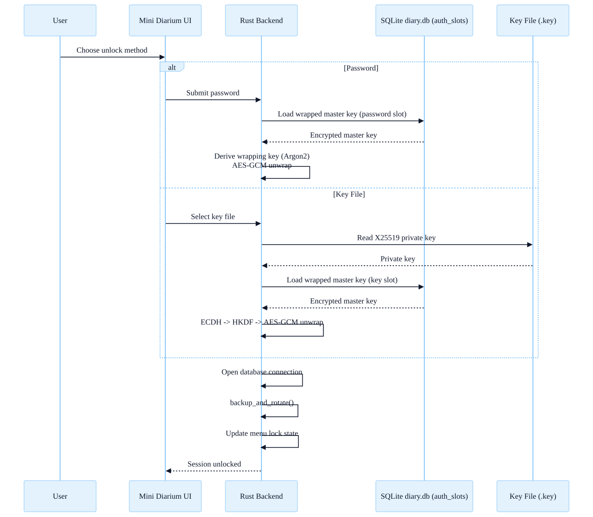
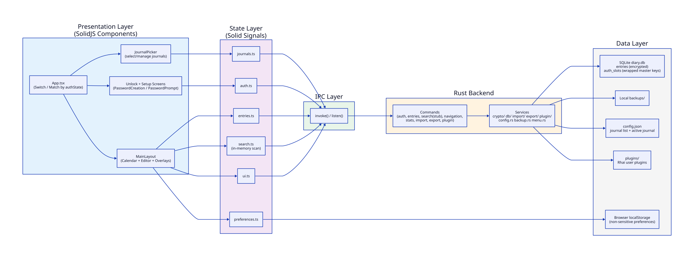

# Architecture

This document describes Mini Diarium's high-level architecture and data flow.

- For principles and design philosophy, see [PHILOSOPHY.md](../PHILOSOPHY.md).
- For the full threat model and cryptographic details, see [SECURITY.md](../SECURITY.md).
- For a privacy overview, see [docs/PRIVACY.md](PRIVACY.md).

## Unlock Model

Mini Diarium uses a wrapped master key design.

- A random master key encrypts all entries using AES-256-GCM
- Authentication methods wrap the master key
- Unlocking unwraps the master key into memory for the session

## Unlock Flow

<picture>
  <source media="(prefers-color-scheme: dark)" srcset="./diagrams/unlock-dark.svg">
  
</picture>

### Password Unlock

- Argon2 key derivation
- AES-GCM unwrap of master key

### Key File Unlock

- X25519 key pair
- ECDH followed by HKDF
- AES-GCM unwrap of master key

The master key is never stored in plaintext.

---

## System Context

Everything runs locally on the user's machine.

<picture>
  <source media="(prefers-color-scheme: dark)" srcset="./diagrams/context-dark.svg">
  
</picture>

### Properties

- The UI communicates with the Rust backend via Tauri `invoke()`
- The backend reads and writes to local SQLite
- No HTTP clients
- No background sync
- No telemetry

---

## Saving an Entry

When saving an entry:

1. The content is encrypted using the master key.
2. The encrypted content is stored in the `entries` table.

  <picture>
    <source media="(prefers-color-scheme: dark)" srcset="./diagrams/save-entry-dark.svg">
    
  </picture>

---

## Layered Architecture

Mini Diarium follows a layered structure.

<picture>
  <source media="(prefers-color-scheme: dark)" srcset="./diagrams/architecture-dark.svg">
  
</picture>

