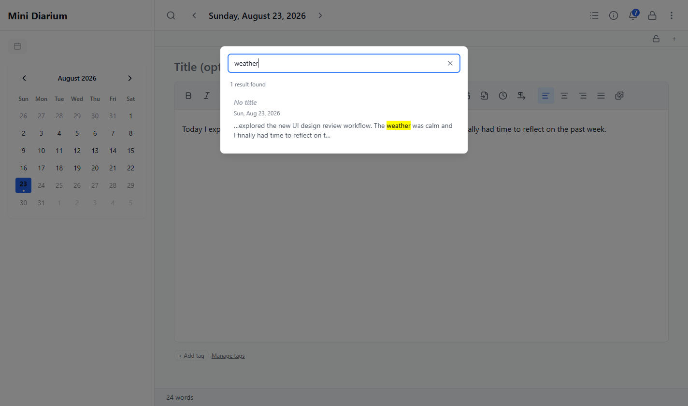
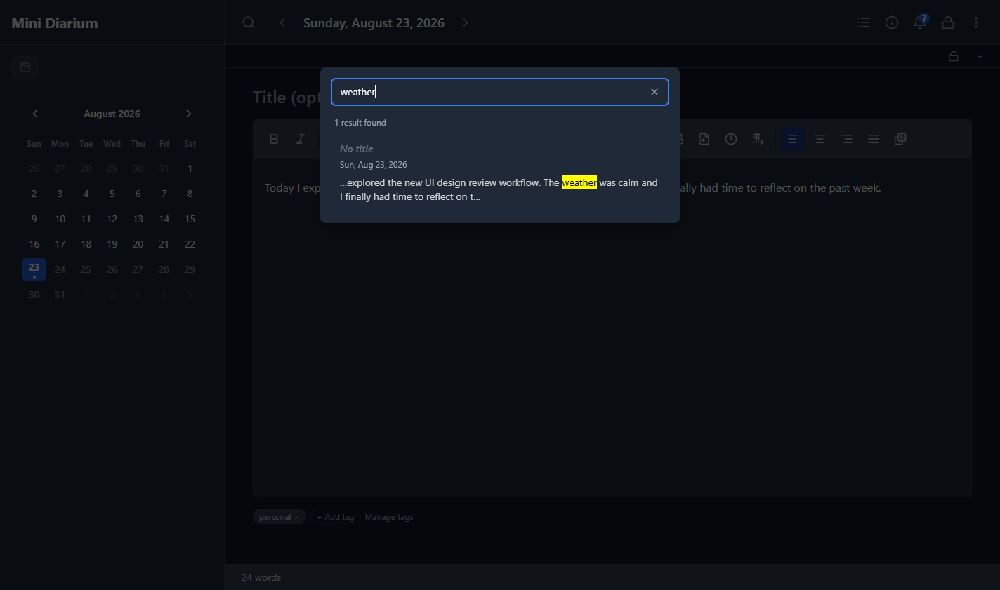
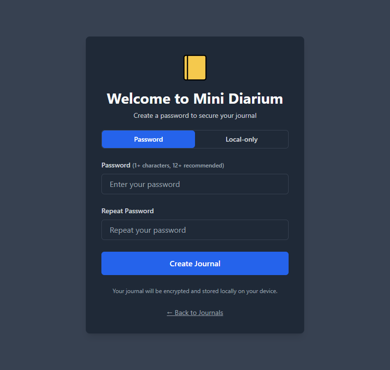
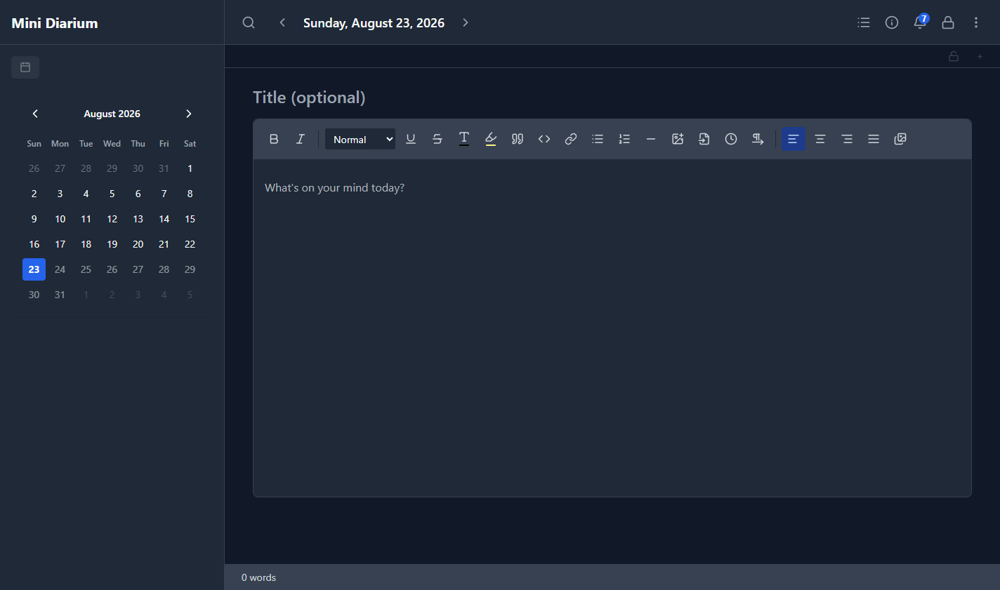
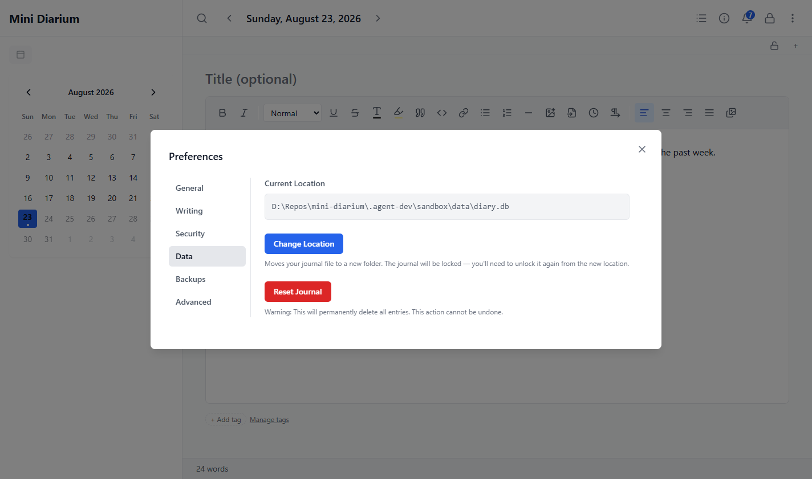
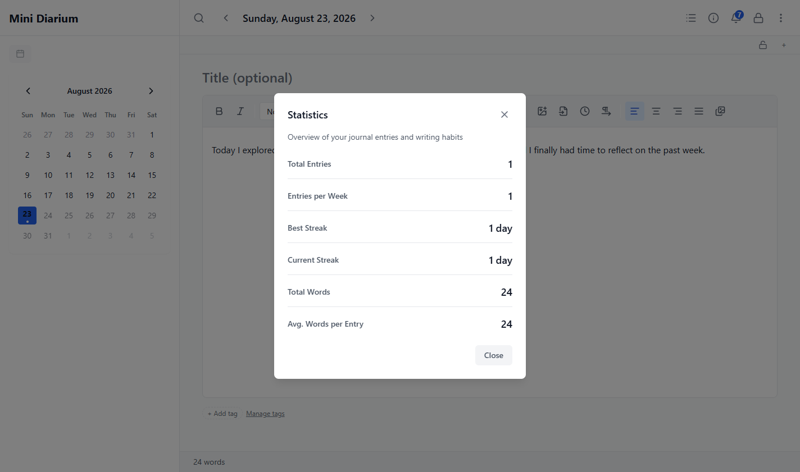

# UI Design & UX Review — 2026-08-23

**Scope:** Full walkthrough of the live app (journal creation → first entry → search → preferences → export/stats/backups) in both light and dark theme, driven via `tauri-agent-dev` against a fresh sandbox journal, cross-checked against [`docs/DESIGN_SYSTEM.md`](../DESIGN_SYSTEM.md) and the app's own source.

**Filter applied:** only findings that change what a real user sees or risks in normal use are listed. Cosmetic nits with no behavioral consequence (spacing, redundant label text, control sizing) were found and deliberately cut — they don't earn a place in this report.

---

## Part 1 — Design System Compliance

### 1. Search match highlighting is unstyled browser default, not the documented amber token — **High**

The one documented highlight color in the whole app is amber (`#b45309` light / `#fbbf24` dark), reserved by [`DESIGN_SYSTEM.md`](../DESIGN_SYSTEM.md#implementation-rules) rule 7 for the editor's `<mark>` and nothing else. `SearchResults.tsx` renders the backend's match snippet as raw HTML containing `<mark>` tags (`src/components/search/SearchResults.tsx:118`), but no CSS anywhere targets that `<mark>` outside the editor — `grep` across `src/**/*.css` finds exactly one rule, `.ProseMirror mark { … }` in `src/styles/editor.css:162`, scoped to the editor only. The result: every search-match highlight falls back to the browser/WebView2 user-agent default (`background: yellow`), completely outside the design system's control.

In light mode it merely clashes; in dark mode it's actively jarring — a saturated yellow chip sitting directly on the app's near-black card background, next to text everywhere else rendered in on-brand grays and blues.

| Light mode | Dark mode |
|---|---|
|  |  |

**Fix:** style the search snippet's `<mark>` explicitly (e.g. a `.search-snippet mark` rule, or a shared class applied where the snippet HTML is rendered) using theme-aware tokens — either reuse `--editor-highlight-color` for visual continuity with the editor's own highlight feature, or introduce a dedicated `--search-highlight-*` pair if editor-highlight and search-match should stay conceptually distinct. Either way, it must be governed by a token, not left to the UA stylesheet.

### 2. Destructive font-delete button bypasses the documented `.text-destructive` utility — **Medium**

`src/components/overlays/preferences/PreferencesCustomFontsSection.tsx:135`:

```
class="text-xs text-red-500 hover:text-red-700 ml-4 shrink-0"
```

This is not a judgment call — [`DESIGN_SYSTEM.md`](../DESIGN_SYSTEM.md#utility-classes) lists `.text-destructive` as the utility that *replaces exactly this pattern* (`text-red-500 hover:text-red-700`). The button also has no dark-mode variant, so its color doesn't shift with the rest of the UI.

**Fix:** `class="text-xs text-destructive ml-4 shrink-0"`.

### 3. Image-picker error banner mixes raw Tailwind red with the status-token system — **Low-Medium**

`src/components/overlays/ImagePickerOverlay.tsx:230`:

```
class="mb-4 rounded-md border border-red-300/60 bg-red-500/10 px-3 py-2 text-sm text-error"
```

`text-error` (a real token class) is used for the text, but the background and border are hand-picked opacity-modified Tailwind reds instead of `.bg-error`/`.border-error`, so this one banner won't track future changes to the documented error token values, and its dark-mode appearance is whatever `red-500/10` happens to render as rather than the deliberately-chosen dark-mode error tokens.

**Fix:** `class="mb-4 rounded-md border-error bg-error px-3 py-2 text-sm text-error"`.

### 4. Undocumented pink accent on "Support" affordances — **Low**

`AboutOverlay.tsx:107` and `Header.tsx:122` both render a heart icon with `class="text-pink-500"` (pinned by both components' tests, so this is intentional and stable, not a stray value). Pink does not appear anywhere in `DESIGN_SYSTEM.md`'s palette — the doc accounts for blue (interactive), gray (neutral), amber (editor highlight / warning), green/red/blue (status), and gold (website/logo only), with an explicit instruction not to introduce a second accent color without updating the document.

Heart-icon-for-support is a well-worn convention and not worth re-theming. The gap is purely documentary.

**Fix:** add one line to `DESIGN_SYSTEM.md` recording pink as a deliberate, narrowly-scoped exception for support/donation affordances only — so a future contributor doesn't "fix" it into blue, and so it doesn't quietly spread into unrelated UI.

### 5. Auth screens don't actually stay light — the doc's own claim doesn't match behavior — **Medium**

[`DESIGN_SYSTEM.md`](../DESIGN_SYSTEM.md#app-css) states as fact: *"auth screens are always rendered in light mode regardless of theme preference (the `.dark` class is applied to `<html>` only after the main app mounts)."*

Verified against the live app: on a fresh sandbox with theme preference `auto` and the OS/WebView resolving `prefers-color-scheme: dark`, the journal-creation screen renders with `document.documentElement.className === "dark"`, `body` background `rgb(17,24,39)` (`--bg-secondary` dark value), and the card background `rgb(31,41,55)` (`--bg-primary` dark value) — the full app dark token set, not `critical-auth.css`'s hardcoded light colors.



The reason: `initializeTheme()` (`src/lib/theme.ts`) is called from `App()`'s `onMount` (`src/App.tsx:85-87`), and `App` is the same component whose `<Switch>` renders `JournalPicker` / `PasswordCreation` / `PasswordPrompt`. There is no phase, once JavaScript has taken over, where the auth screens render separately from "the main app" — `critical-auth.css` only covers the raw-HTML-parse window *before* the bundle executes, not the entire lifetime of the auth screens as the doc currently implies.

This is a documentation-vs-implementation fork, not an obvious bug, and the correct fix depends on intent this review can't resolve on its own:

- **If dark auth screens are fine** (the rendered result is in fact clean and on-brand — see screenshot above): correct the doc to say `critical-auth.css` only prevents the pre-hydration flash, and that auth screens follow the normal theme system once mounted, same as everything else.
- **If "auth always light" was a deliberate decision** (e.g. a consistent, security-forward first impression regardless of OS theme): the three auth components need to force `activeTheme() === 'light'` rendering regardless of the resolved theme, which they currently don't.

Either resolution is a small change; what matters is that the doc and the code currently disagree, and whoever owns this should pick one on purpose.

---

## Part 2 — UX Review, Walked as a New User

Ordered by the journey actually taken: create a journal → write the first entry → search it → configure preferences.

### 1. A new user's first week arrives half-grayed-out with no explanation — **High**

`allowFutureEntries` defaults to `false` (`src/state/preferences.ts:87`). On first launch, every day after today in the visible calendar month renders `disabled` — verified live: with "today" at Aug 23, every day from Aug 24 through the end of the calendar grid (into September) was disabled.



The disabled buttons carry no distinguishing `title`/tooltip and no reason in their `aria-label` (`Calendar.tsx` only appends "has entry" / "has locked entry" suffixes) — there's no in-context way for a new user to learn *why* a third or more of the visible month is unclickable. The setting that controls it, "Allow future entries," lives three levels deep: overflow menu → Preferences → Writing tab.

**Fix:** at minimum, give disabled future days a `title` explaining the restriction and pointing at the setting. Longer-term, consider flipping the default — most journaling apps let people pre-write or plan ahead by default, and "can't click days in the calendar" is a more common source of confusion than "accidentally wrote something in the future" is a problem worth protecting against by default.

### 2. Two unrelated "welcome" surfaces compete in the first 30 seconds — **Medium**

A brand-new journal — one that has never had an entry — simultaneously shows the onboarding tour overlay *and* a notification bell badged "7 unread," full of historical release notes and announcements predating the journal's existence. Both are vying for the same first-impression attention window, and neither yields to the other: dismissing onboarding doesn't touch the notification badge, and opening notifications happens over top of (or instead of) finishing the tour.

**Fix:** either suppress the notification badge until onboarding is dismissed, or mark pre-existing release notes as already-read for a newly-created journal so the badge starts at zero. One first-run guide at a time.

### 3. Search's broken highlight color is where a user actually encounters Finding #1 above

Covered in full under Part 1 §1 — flagged here only to note *when* a user hits it: the first time they search, immediately after writing their first entry. It's not a buried edge case.

### 4. A destructive, irreversible action sits inches from a routine one, distinguished only by color — **High (data-loss risk)**

Preferences → Data tab stacks two full-width, equal-weight buttons with a small gap between them: **"Change Location"** (routine, blue) directly above **"Reset Journal"** (permanently deletes every entry, no undo, red). Only the fill color tells them apart at a glance; there's no divider, no reduced visual weight for the dangerous option, no step-up in confirmation cost proportional to the consequence.



**Fix:** for an action this irreversible, standard error-prevention practice applies: separate it with a section break, drop it to a lower-emphasis control (e.g. a plain destructive text link rather than a filled button matching "Change Location"'s visual weight), and gate it behind typed confirmation (retype "delete" or the journal name) rather than a single confirm-dialog click.

### 5. "Statistics" is a plain six-row text table — **Medium**

The Statistics dialog (Total Entries, Entries per Week, Best Streak, Current Streak, Total Words, Avg. Words per Entry) is entirely text, right-aligned numbers against left-aligned labels, no color, no chart, no visual hierarchy beyond bold. For a feature whose name and entry point (a dedicated header icon) both promise "insight into your writing habits," a plain vertical list under-delivers against that expectation.



**Fix:** not asking for a dashboard — one lightweight visual element would close most of the gap, e.g. a small streak strip/heatmap for the current month, or visually emphasizing the current streak (the number most journaling apps treat as the "hero" stat) instead of listing it as a same-weight row among six.

### 6. Backup status copy reassures before it's earned that reassurance — **Medium (trust issue on a data-safety surface)**

Preferences → Backups shows, stacked immediately together: **"Backups are working."** in green, then **"No backup has been taken yet."** In an encrypted, local-only journal where backups are the entire safety net against data loss, a green "working" status appearing before any backup actually exists reads as false reassurance — exactly the kind of copy a user skims and trusts without reading the second line.

**Fix:** don't show the green "working" line until at least one backup exists. Before that, something like "Backups will start automatically after your first change" is equally reassuring and actually true.

---

## Summary

| # | Finding | Part | Value |
|---|---|---|---|
| 1 | Search highlight uses unstyled browser-default `<mark>` | Design system | High |
| 2 | Font-delete button bypasses `.text-destructive` | Design system | Medium |
| 3 | Image-picker error banner mixes raw red with status tokens | Design system | Low-Medium |
| 4 | Undocumented pink "support" accent | Design system | Low |
| 5 | Auth-screen light/dark doc vs. implementation mismatch | Design system | Medium |
| 6 | Disabled future days with no explanation | UX | High |
| 7 | Onboarding tour + notification badge compete on first run | UX | Medium |
| 8 | Reset Journal sits undifferentiated next to a routine action | UX | High |
| 9 | Statistics dialog is plain text, no visualization | UX | Medium |
| 10 | Backup "working" status shown before any backup exists | UX | Medium |

Screenshots referenced above live in [`docs/archive/assets/2026-08-23-ui-design-review/`](assets/2026-08-23-ui-design-review/).

> **Archived**: all findings in this report have been addressed. See the "UI/UX design review fixes" entry in `CHANGELOG.md` and the Reset Journal button correction in `docs/best-practices/FRONTEND_BEST_PRACTICES.md`'s "Use Design-System Tokens, Not Invented Ad Hoc Styles" section.
