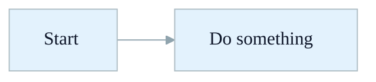
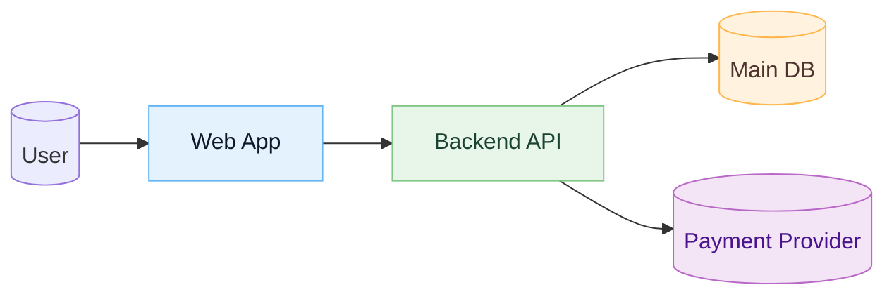
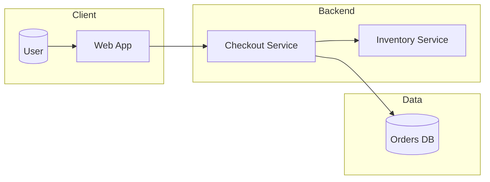
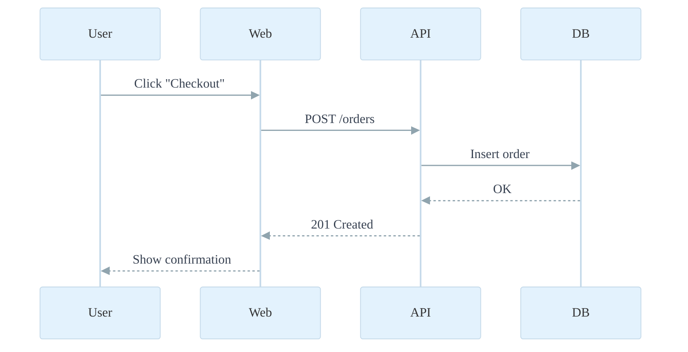

# Best Practices for Beautiful Mermaid Diagrams

These rules define how to create clear, aesthetically pleasing Mermaid diagrams for documentation and architecture.

## 1. Goals

- Make diagrams easy to read for both technical and non-technical people.
- Use consistent themes, colors, and shapes across all diagrams.
- Favor simplicity and clarity over showing every detail.

---

## 2. Use a clean base theme

- Prefer the `base` theme with custom `themeVariables` instead of the default theme.
- Define your palette and font once and reuse it in all diagrams.

Example global init block:



Guidelines:

- Use soft, desaturated colors and strong contrast for text.
- Keep the same theme config across a project or documentation set.

---

## 3. Use classes for visual hierarchy

- Define a few semantic classes and apply them to nodes instead of ad-hoc styling.
- Map classes to the role of the node (frontend, backend, data, external, warning).

Example:



Guidelines:

- Limit yourself to 3–5 classes to keep visuals coherent.
- Do not mix many different colors without semantic meaning.

---

## 4. General diagram content rules

- One main idea per diagram (flow, context, or component view).
- Use short, descriptive node labels; move long explanations into surrounding text.
- Use consistent naming across diagrams (e.g. "Checkout Service" always has the same name).
- Label only important edges; avoid labeling every arrow.

Examples of good labels:

- `Checkout Service`
- `Main DB`
- `Public API`

Examples to avoid:

- Overly technical internal code names, like `svc-checkout-v2-blue`.
- Full URLs or endpoints unless required, like `https://api.example.com/v1/orders`.

---

## 5. Layout best practices (flowcharts)

- Choose a single direction: `LR` (left-to-right) or `TB` (top-to-bottom).
- Order node declarations roughly in the visual reading order.
- Minimize crossing lines by reordering or grouping.
- Use subgraphs for logical grouping, with short titles.

Example:



Guidelines:

- Keep individual diagrams under ~20 nodes for readability.
- Split complex systems into multiple diagrams (context, containers, components).

---

## 6. Layout best practices (sequence diagrams)

- Use straight, right-angled messages when possible for a cleaner look.
- Keep participant names short and consistent.
- Avoid too many nested activations or deeply nested calls; split into separate diagrams if needed.

Example configuration:



Guidelines:

- Put the most important lifelines near the center.
- Keep sequence diagrams focused on a single flow.

---

## 7. Styling for dark vs light backgrounds

- For light-mode docs, use soft light backgrounds and dark text.
- For dark-mode docs, define a separate theme with darker background colors and lighter text.

Example dark theme variables (pseudo):

```json
{
  "theme": "base",
  "themeVariables": {
    "background": "#020617",
    "primaryColor": "#0F172A",
    "primaryTextColor": "#E5E7EB",
    "primaryBorderColor": "#1E293B",
    "lineColor": "#64748B"
  }
}
```

Guidelines:

- Ensure sufficient contrast according to accessibility guidelines.
- Do not rely on pure black (#000) and pure white (#fff); use slightly softer values.

---

## 8. Typography and spacing

- Use one sans-serif font family across all diagrams.
- Avoid very small text; prefer a font size that remains readable when embedded.
- Use concise labels to avoid overflowing nodes.
- Keep enough space between nodes for labels and arrows to be readable.

---

## 9. Consistency across a project

- Reuse the same init block (theme + classes) for all diagrams in a repository.
- Standardize on:
  - Node naming conventions.
  - Direction (`LR` or `TB`).
  - Color semantics for classes.
- Store common Mermaid config in a shared snippet or documentation file for reuse.

---

## 10. What to avoid

- Avoid mixing many diagram types (flowchart, sequence, state) in a single Mermaid block.
- Avoid using too many colors or styles without clear meaning.
- Avoid cramped diagrams with lots of crossing edges.
- Avoid duplicating the same information in labels and surrounding text.

---

Use these rules whenever you create Mermaid diagrams. The result should be simple, readable, and visually consistent across your documentation.
